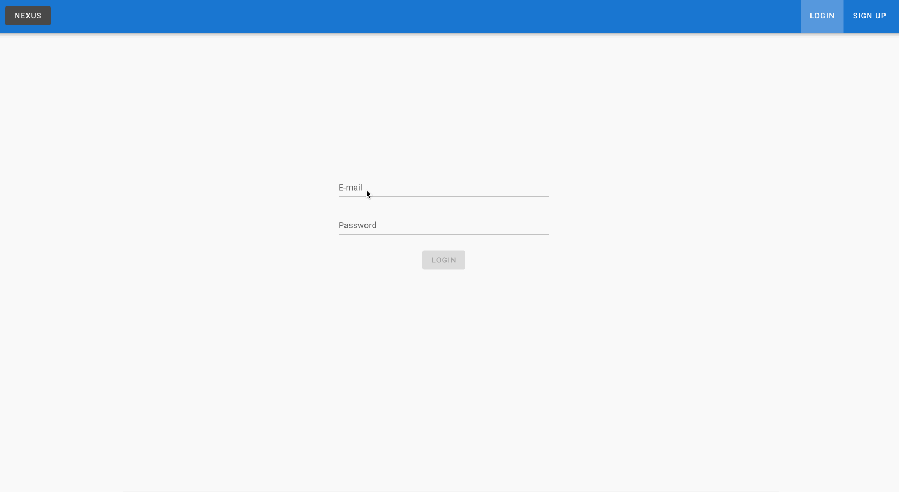

# Nexus

## Table of Contents
* [Introduction](#introduction)
* [How to get started](#how-to-get-started)
* [Motivation](#motivation)
* [Technologies](#technologies)
* [Key Features](#key-features)
* [Future Developments](#future-developments)
* [Demo](#demo)

## Introduction

This project is a clone of [Trello](https://trello.com/). Trello is a collaboration tool that allows users to organise projects using boards, lists and cards. 

## How to get started

#### Using my site
1. Visit https://nexus-client.netlify.com/#/signup and make an account.
2. Login at https://nexus-client.netlify.com/ and create a board to start creating lists and cards.

#### To test locally
Feel free to clone this repository.

After cloning:

**In the client directory in the terminal:**
1. Run `npm install` and
2. Run `npm run serve`

**In the server directory in the terminal:**
1. Run `npm install`
2. Run `npm run dev`

**In the root directory in the terminal**
1. If you don't have MongoDB installed locally, install MongoDB Community Edition https://docs.mongodb.com/manual/tutorial/install-mongodb-on-os-x/.
2. Run `mongo "mongodb://localhost:27017/nexus_server"`

## Motivation

Having used [React](https://reactjs.org/) on my last few projects, I wanted to explore and learn [Vue](https://vuejs.org/), another JavaScript framework. Trying to clone Trello was a fun project idea and gave me many avenues to explore the different aspects of Vue.

## Technologies

This project is created with:

* [Vue v2.6.10](https://vuejs.org/)
* [Vuex v3.1.2](https://vuex.vuejs.org/) - a state management library
* [Feathers v4.4.3](https://feathersjs.com/)
* [FeathersVuex v3.4.0](https://vuex.feathersjs.com/)
* [Mongoose v5.8.7](https://mongoosejs.com/)
* [MongoDB v3.4.1](https://www.mongodb.com/)
* [Vuetify v2.1.0](https://vuetifyjs.com/en/) - a Vue UI library

## Key Feaures
* **Creation of boards** - create boards (projects) and, within those boards, create lists with cards
* **Move cards between lists** - drag and drop cards to move them between lists

## Future Developments
These are following features I would like to add:
* **Adding members to boards** - at the moment, only the board creator can work on the board. I would like to allow members to be added to collaborate on a board.
* **Rearrange lists** - allow lists to be rearranged in an order the user wants. This is a key feature of Trello.
* **Rearrange cards within lists** - allow users to rearrange cards within lists. This is a key feature of Trello.
* **Detail description of task within each card** - allow more information to be added within each card through clicking and opening a modal.
* **Archiving of boards** - allow boards to be achived once a project has been completed.

There's so much more to add! Check out [Trello](https://trello.com/) to test out their amazing app.

## Demo

